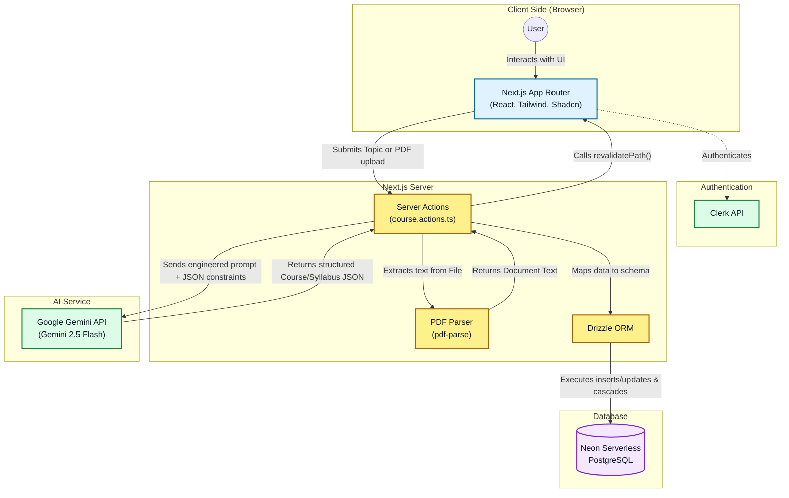

# SyllabAI

**SyllabAI** is an AI-powered course and syllabus generator that helps educators, students, and developers create structured learning content automatically.

Using **Google Gemini AI**, SyllabAI can generate a full course — including chapters, lessons, and quizzes — from a simple topic or an uploaded PDF document.

The platform provides an interactive dashboard where users can manage generated courses and track their learning progress.

---

# 🏗️ Architecture

SyllabAI follows a **modern serverless architecture** built with the Next.js App Router.

* **Frontend & API:** Next.js (App Router)
* **Authentication:** Clerk
* **Database:** PostgreSQL (Neon)
* **ORM:** Drizzle ORM
* **AI Engine:** Google Gemini (via `@google/generative-ai`)
* **PDF Processing:** `pdf-parse`

The AI model processes prompts and returns structured course data, which is stored in PostgreSQL and displayed through the dashboard.



---

# 🚀 Features

### AI Course Generation

Generate complete courses by entering a simple topic.
Courses include structured chapters, lessons, and quizzes.

### PDF to Course

Upload a PDF and automatically convert its content into a structured learning course.

### Structured Syllabus

Each course contains:

* Chapters
* Lessons
* Quiz questions

### User Dashboard

Users can:

* View generated courses
* Track progress
* Manage course content

### Interactive Learning Content

Lessons support:

* Rich text
* Mermaid diagrams

### Advanced Analytics & Tracking

The dashboard provides comprehensive statistics:

* **Activity Heatmap:** GitHub-style daily streak tracking
* **Time Spent:** Track estimated and actual time spent learning
* **Accuracy Metrics:** Topic-by-topic quiz performance

### Export Options

Export your fully generated courses seamlessly:

* **PDF Export:** Clean, printable view retaining all diagrams and formatting
* **Markdown Export:** Direct download of structured `.md` files

### Study Buddy

* **Voice-Enabled AI Tutor:** Engage in interactive, live voice sessions to clear doubts and solidify understanding.

### Course Management

Users can delete courses, and all related chapters, quizzes, and questions are automatically removed using **cascade deletion**.

---

# 🛠️ Tech Stack

| Category       | Technology           |
| -------------- | -------------------- |
| Frontend       | Next.js (App Router) |
| Language       | TypeScript           |
| AI             | Google Gemini        |
| Authentication | Clerk                |
| Database       | PostgreSQL (Neon)    |
| ORM            | Drizzle ORM          |
| File Parsing   | pdf-parse            |

---

# 🎬 Demo

A short demo of SyllabAI in action.

```
[Add demo video link here]
```
---

# 📸 Screenshots

### Course Generation

```
[Add screenshot here]
```

### Dashboard

```
[Add screenshot here]
```

### Lesson View

```
[Add screenshot here]
```

---

# 🚦 Getting Started

## Prerequisites

Make sure you have:

* **Node.js 18+**
* **pnpm**
* **Neon PostgreSQL account**
* **Clerk account**
* **Google Gemini API Key**

---

# Installation

Clone the repository

```bash
git clone https://github.com/Sarcastic-Soul/SyllabAI.git
cd syllabai
```

Install dependencies

```bash
pnpm install
```

---

# Environment Variables

Create a `.env.local` file in the root directory.

```
# Clerk
NEXT_PUBLIC_CLERK_PUBLISHABLE_KEY=
CLERK_SECRET_KEY=
NEXT_PUBLIC_CLERK_SIGN_IN_URL=/sign-in
NEXT_PUBLIC_CLERK_SIGN_UP_URL=/sign-up
NEXT_PUBLIC_CLERK_SIGN_IN_FORCE_REDIRECT_URL=/dashboard
NEXT_PUBLIC_CLERK_SIGN_UP_FORCE_REDIRECT_URL=/dashboard

# Database
DATABASE_URL=

# Google Gemini
NEXT_PUBLIC_GEMINI_API_KEY=
```

You may also create a `.env.example` file for easier setup.

---

# Database Setup

Push the schema to Neon using Drizzle:

```bash
pnpm exec drizzle-kit push
```

---

# Running the Project

Start the development server:

```bash
pnpm dev
```

Open in browser:

```
http://localhost:3000
```

---

# 📚 Database Schema

The database contains relational tables for:

* Users
* Courses
* Chapters
* Lessons
* Quizzes
* Questions

All related data is automatically deleted when a course is removed using **`onDelete: cascade`**.

```mermaid
erDiagram

    USERS {
        text id PK
        text email
        integer coursesGenerated
        integer currentStreak
        jsonb activityMap
        integer totalTimeSpent
        timestamp lastActive
        timestamp createdAt
    }

    COURSES {
        uuid id PK
        text author
        text topic
        integer duration
        text difficulty
        integer timeSpent
        boolean isCompleted
        timestamp createdAt
    }

    CHAPTERS {
        uuid id PK
        uuid courseId FK
        text title
        text content
        text lessonText
        integer order
        boolean isCompleted
        boolean isBookmarked
    }

    QUIZZES {
        uuid id PK
        uuid chapterId FK
        integer score
        boolean isCompleted
    }

    QUESTIONS {
        uuid id PK
        uuid quizId FK
        text questionText
        jsonb options
        integer correctAnswer
    }

    COURSES ||--o{ CHAPTERS : contains
    CHAPTERS ||--o{ QUIZZES : has
    QUIZZES ||--o{ QUESTIONS : includes
