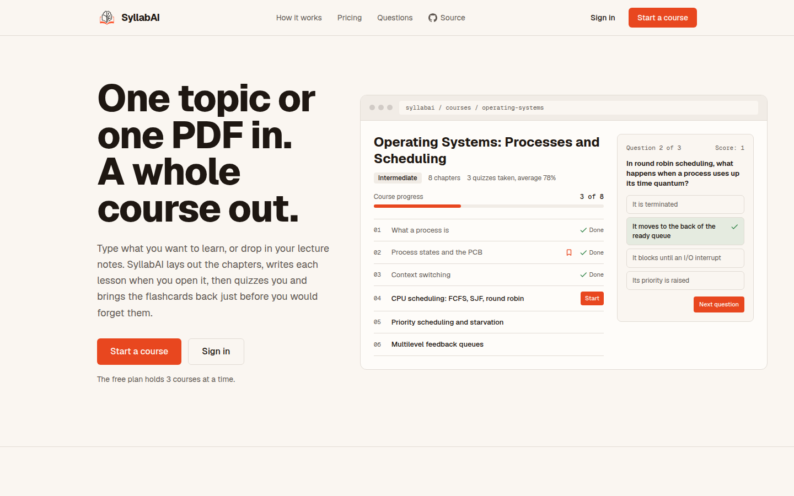
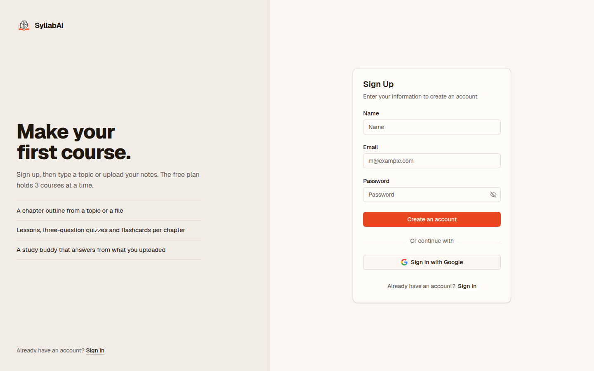
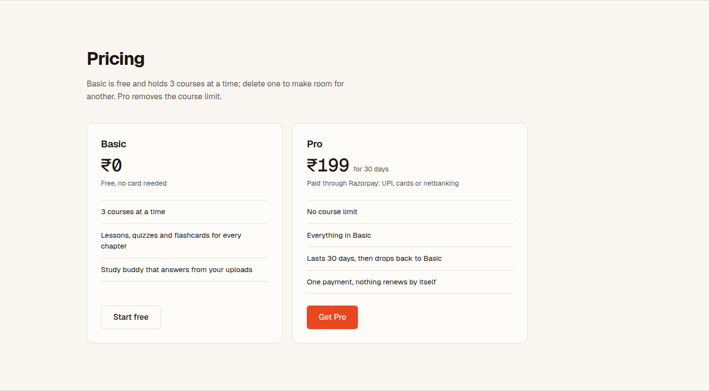

<div align="center">


# SyllabAI

**One topic or one PDF in. A whole course out.**

Type what you want to learn, or upload your notes. SyllabAI lays out the chapters, writes each lesson, then quizzes you and brings the flashcards back just before you would forget them.

[](https://github.com/Sarcastic-Soul/SyllabAI/actions/workflows/ci.yml)
[](https://syllabai-edu.vercel.app)


[Live site](https://syllabai-edu.vercel.app) · [Features](#features) · [How it works](#how-it-works) · [Run it locally](#run-it-locally)

</div>



<!-- DEMO VIDEO: goes here -->

## Contents

- [Features](#features)
- [Screenshots](#screenshots)
- [How it works](#how-it-works)
- [Tech stack](#tech-stack)
- [Run it locally](#run-it-locally)
- [Scripts](#scripts)
- [Project layout](#project-layout)
- [Design decisions](#design-decisions)
- [Limits](#limits)
- [Retrieval eval](#retrieval-eval)

## Features

**Learning**

- **Course from a topic or a file.** Type a topic, or upload `.pdf`, `.txt`, `.md`, `.csv` or `.json` (up to 4 MB and 100,000 characters).
- **Lessons written when you open them.** You get the chapter list first; each lesson, quiz and flashcard set is generated when you reach it.
- **Quizzes and flashcards.** Three questions per chapter, plus flashcards on an SM-2 spaced repetition schedule.
- **Adaptive difficulty.** Quiz difficulty moves with your flashcard recall and past scores.
- **Study buddy.** A chat that answers from the document you uploaded.
- **Diagrams and cheat sheets.** Mermaid diagrams per chapter (with PNG download) and a one-page cheat sheet per course.
- **Public sharing.** Any course can get a public link that works without an account.
- **Progress.** Streaks, quiz average, bookmarks and an activity map.

**Under the hood**

- **Hybrid document search.** pgvector cosine similarity plus Postgres full-text search, merged with reciprocal rank fusion in one SQL statement.
- **Checked AI output.** Gemini returns structured JSON, Zod checks it, and one retry with the error message fixes most bad replies.
- **Model fallback.** Switches from `gemini-3.8-flash` to `gemini-3.5-flash-lite` when the daily quota runs low.
- **Per-call log.** Every AI call writes a row (step, model, tokens, duration, result). The admin page shows calls, tokens and p50/p95 duration per step.
- **Auth and payments.** Neon Auth (Google or email and password, with an email code at sign-up) and a one-time Pro pass through Razorpay.

## Screenshots

| Sign up | Pricing |
| :---: | :---: |
|  |  |

## How it works

```
Browser
  │  POST /api/generate/topic | /api/generate/pdf   (one request, waits for the result)
  ▼
Next.js route handler (Node.js runtime, maxDuration 300)
  │
  ├─ Google Gemini ........ gemini-3.8-flash / gemini-3.5-flash-lite (text and JSON)
  │                         gemini-embedding-001 (768-dim vectors)
  ├─ Neon PostgreSQL ...... courses, chapters, quizzes, flashcards, payments,
  │                         document_chunks (pgvector + full-text), generation_logs
  ├─ Neon Auth ............ users and sessions, in the same database
  └─ Razorpay ............. order, signature check, webhook
```

| Step | What happens |
| --- | --- |
| 1. Input | A topic, or a file that is split into chunks of about 1,000 characters (150 overlap) and embedded at 768 dimensions. |
| 2. Outline | Gemini returns the chapter list as JSON; Zod checks it before anything is saved. |
| 3. Lesson | Written when the chapter is opened. For uploaded files, the most relevant chunks are found with hybrid search and passed in. |
| 4. Practice | Quiz and flashcards per chapter. Flashcard reviews follow SM-2 (`easeFactor`, `interval`, `nextReviewAt`). |
| 5. Log | Each AI call is logged to `generation_logs`. The daily quota counter per model is a count over that table. |

All Gemini text and JSON calls go through `lib/ai/generate.ts`. Document search goes through `lib/retrieval.ts`.

### Plans

| | Basic | Pro |
| --- | --- | --- |
| Price | Free | ₹199 for 30 days |
| Courses at a time | 3 | No limit |
| Lessons, quizzes, flashcards, study buddy | Yes | Yes |
| Renewal | – | One payment, nothing renews by itself |

Razorpay runs in test mode on the live site, so no real money moves. Price and length are set in `lib/billing/config.ts`.

## Tech stack

| Area | Tools |
| --- | --- |
| Framework | Next.js 16 (App Router), React 19, TypeScript 6 |
| Styling | Tailwind CSS v4, Radix UI, Phosphor icons, Motion |
| AI | Google Gemini via `@google/genai`, Zod for output checks, `unpdf` for PDF text |
| Database | Neon PostgreSQL, `pgvector` (HNSW index), full-text search (`tsvector` + GIN index), Drizzle ORM |
| Auth | Neon Auth (Managed Better Auth) |
| Payments | Razorpay (HMAC SHA256 signature check plus webhook) |
| Charts and logs | Recharts, Pino |
| Tests and CI | Vitest, ESLint, GitHub Actions |
| Hosting | Vercel |

## Run it locally

You need Node.js 22.18 or newer, pnpm, a Neon project and a Gemini API key.

```bash
git clone https://github.com/Sarcastic-Soul/SyllabAI.git
cd SyllabAI
pnpm install
cp .env.example .env.local
```

Fill in `.env.local`:

| Variable | Where to get it |
| --- | --- |
| `DATABASE_URL` | Neon console, connection string |
| `GEMINI_API_KEY` | Google AI Studio |
| `NEON_AUTH_BASE_URL` | Neon console, Auth tab, Configuration |
| `NEON_AUTH_COOKIE_SECRET` | Any random string of 32+ characters: `openssl rand -base64 32` |
| `RAZORPAY_KEY_ID`, `RAZORPAY_KEY_SECRET` | Razorpay dashboard, API Keys (test mode keys start with `rzp_test_`) |
| `RAZORPAY_WEBHOOK_SECRET` | A secret you choose when adding the webhook in the Razorpay dashboard |

Set up the database, then start the app:

```bash
node enable-vector.ts    # new database only: turns on the pgvector extension
pnpm run db:migrate      # applies the SQL files in lib/db/migrations
pnpm dev
```

Open [http://localhost:3000](http://localhost:3000).

In the Neon console (Auth tab), turn on email sign-up with "Verify at Sign-up" set to verification code, add Google, and allow localhost.

## Scripts

| Command | What it does |
| --- | --- |
| `pnpm dev` | Development server with Turbopack |
| `pnpm build` / `pnpm start` | Production build and server |
| `pnpm test` | Unit tests (Vitest) |
| `pnpm typecheck` / `pnpm lint` | TypeScript and ESLint checks |
| `pnpm run db:generate` / `pnpm run db:migrate` | Write and apply SQL migrations |
| `pnpm run db:push` | Push the schema straight to the database |
| `pnpm eval` | Retrieval eval (see below) |

## Project layout

```
app/                 pages and API routes (auth, dashboard, courses, admin, razorpay)
components/          UI, grouped by area (landing, course, dashboard, billing, admin)
lib/ai/              Gemini calls, embeddings, per-call log
lib/auth/            Neon Auth server and client setup, session helper
lib/billing/         plan limits, Razorpay calls and signature checks
lib/db/              Drizzle schema and SQL migrations
lib/generator/       course outline generation
lib/actions/         server actions: lessons, quizzes, flashcards, study buddy
lib/retrieval.ts     hybrid document search
eval/                retrieval eval: documents, questions, runner, results
proxy.ts             route guard (Next.js 16 name for middleware)
```

## Design decisions

| Decision | Why | Cost |
| --- | --- | --- |
| One request per course, no worker queue | Runs on Vercel's free tier with no background process to host | Bound by the 300-second function limit; the progress bar is an animation, not real progress |
| Clean up on failure | If generation fails halfway, the half-made course is deleted | A retry starts from scratch |
| No Redis | One less service; the daily quota is a count over `generation_logs` | No caches, so the same topic calls Gemini again |
| Hybrid search over vector-only | Full-text catches exact terms that embeddings miss | On the eval set both score about the same on recall@1 and MRR; hybrid found the answer in the top 5 for every question |
| One-time Pro pass, not a subscription | No renewal logic or stored cards; a `pro_until` date is enough | Users pay again by hand every 30 days |

## Limits

- **Vercel:** 300 seconds per request; uploads capped at 4 MB (Vercel rejects bodies over 4.5 MB).
- **Neon free tier:** 0.5 GiB storage, compute sleeps when idle.
- **Gemini free tier:** `gemini-3.8-flash` 5 requests per minute and 20 per day; `gemini-3.5-flash-lite` 15 per minute and 500 per day.
- **Email:** verification codes come from Neon's shared sender, which is rate-limited.

## Retrieval eval

`eval/` holds a small test of document search: four sample documents, 72 questions with the text a correct chunk must contain, and a runner.

```bash
EVAL_DATABASE_URL=postgres://... pnpm eval
```

| Chunk size | Mode | recall@1 | recall@5 | MRR |
| --- | --- | --- | --- | --- |
| 4,000 | vector | 77.8% | 100% | 0.885 |
| 4,000 | hybrid | 79.2% | 100% | 0.889 |
| 1,000 | vector | 79.2% | 97.2% | 0.873 |
| 1,000 | hybrid | 76.4% | 100% | 0.869 |

- `EVAL_DATABASE_URL` is required. Best is a separate database or Neon branch with pgvector and the migrations applied. With only one database, run `EVAL_DATABASE_URL="$DATABASE_URL" pnpm eval --allow-app-db`.
- The script writes temporary courses and chunks, runs every question through `lib/retrieval.ts` in both modes, then deletes its rows.
- Full results are in [`eval/RESULTS.md`](eval/RESULTS.md), from a real run on 2026-10-03. `pnpm eval --help` lists the options.

---

<div align="center">

A student portfolio project by [Sarcastic-Soul](https://github.com/Sarcastic-Soul).

</div>
